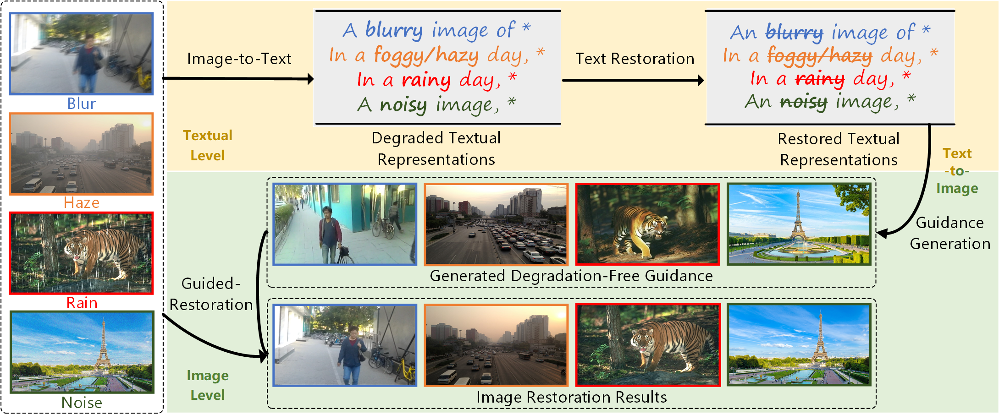
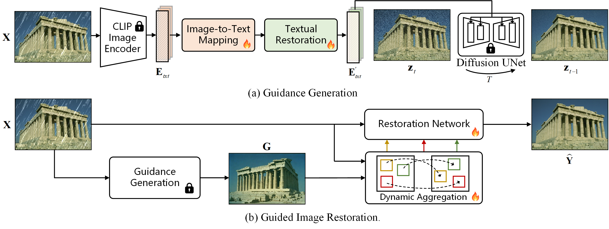

# TextualDegRemoval
Implementation of [**Improving Image Restoration through Removing Degradations in Textual Representations**](https://arxiv.org/abs/2312.17334)

[](https://arxiv.org/abs/2312.17334)

The main contributions of this paper:
>* We introduce a new perspective for image restoration, i.e.,
performing restoration first in textual space where degradations
and content are loosely coupled, and then utilizing
the restored content to guide image restoration
>* To address the cross-modal assistance, we propose to embed
an image-to-text mapper and textual restoration module
into CLIP-equipped text-to-image models to generate
clear guidance from degraded images.
>* Extensive experiments on multiple tasks demonstrate that
our method improves the performance of state-of-the-art
image restoration networks


### 1. Abstract

>In this paper, we introduce a new perspective for improving image restoration by removing degradation in the textual representations of a given degraded image. Intuitively, restoration is much easier on text modality than image one. For example, it can be easily conducted by removing degradation-related words while keeping the contentaware words. Hence, we combine the advantages of images in detail description and ones of text in degradation removal to perform restoration. To address the cross-modal assistance, we propose to map the degraded images into textual representations for removing the degradations, and then convert the restored textual representations into a guidance image for assisting image restoration. In particular, We ingeniously embed an image-to-text mapper and text restoration module into CLIP-equipped text-to-image models to generate the guidance. Then, we adopt a simple coarse-to-fine approach to dynamically inject multiscale information from guidance to image restoration networks. Extensive experiments are conducted on various image restoration tasks, including deblurring, dehazing, deraining, and denoising, and all-in-one image restoration. The results showcase that our method outperforms state-of-the-art ones across all these tasks

### 2. Motivation

<p align="center"></p>

### 3. Framework

<p align="center"></p>

###  Environment Setup

---

```
    conda create -n textualdegremoval python=3.8
    conda activate textualdegremoval
    pip install -r requirements.txt
```


###  Preparation Datasets

---

**Data** and **Pretrained models** preparation please refer to [DatasetPreparation](data_prepare/DatasetPreparation.md).

###  Training

---

**Train image-to-text mapping (I2T)**

```
  CUDA_VISIBLE_DEVICES=0,1,2,3 accelerate launch --config_file 4_gpu.json --main_process_port 25656 scripts/train/main_train_i2t_mapping.py \
  --pretrained_stable_diffusion_path=path_to_stable_diffusion \
  --pretrained_clip_model_path=path_to_clip \
  --num_words=20 \
  --train_data_dir=[paths_to_traindata] \ 
  --placeholder_token="S" \
  --resolution=512 \
  --train_batch_size=4 \
  --gradient_accumulation_steps=4 \
  --max_train_steps=200000 \
  --learning_rate=1e-06 --scale_lr \
  --lr_scheduler="constant" \
  --lr_warmup_steps=0 \
  --output_dir="./experiments/tr_mapping" \
  --i2t_mapper_path=path_to_trained_i2t_mapper_path \
  --save_steps 200
```

**Train Textural-Restoration mapping (TR)**

```
  CUDA_VISIBLE_DEVICES=0,1,2,3 accelerate launch --config_file 4_gpu.json --main_process_port 25656 scripts/train/main_train_tr_mapping.py \
  --pretrained_stable_diffusion_path=path_to_stable_diffusion \
  --pretrained_clip_model_path=path_to_clip \
  --num_words=20 \
  --train_data_dir=[paths_to_traindata] \ 
  --task_list=[task_name_aligned_with_datadir]
  --placeholder_token="S" \
  --resolution=512 \
  --train_batch_size=4 \
  --gradient_accumulation_steps=4 \
  --max_train_steps=200000 \
  --learning_rate=1e-06 --scale_lr \
  --lr_scheduler="constant" \
  --lr_warmup_steps=0 \
  --output_dir="./experiments/tr_mapping" \
  --i2t_mapper_path=path_to_trained_i2t_mapper_path \
  --tr_mapper_path=path_to_trained_tr_mapper_path \
  --save_steps 200
```

**Generate reference images**

```
    CUDA_VISIBLE_DEVICES=0 python scripts/generate/main_generate_reference.py 
    --pretrained_stable_diffusion_path=path_to_stable_diffusion \ 
    --pretrained_clip_path=path_to_clip \ 
    --inference_data_dir=path_to_input_dir \ 
    --i2t_mapper_path=path_to_i2t_mapper \
    --clean_mapper_path=path_to_tr_mapper \
    --num_words=20 \
    --template="a photo of a S"
```

**Train Guided-Restoration**

Training options list in options/train_restoration, e.g. 

```
    CUDA_VISIBLE_DEVICES=0,1,2,3 python -m torch.distributed.launch --nproc_per_node=4 --master_port=1234 scripts/train/main_train_restoration_with_ref_input.py --opt path_to_options --dist True
```


###  Evaluation

---
 
**Gaussian grayscale/color denoising**

```
    python scripts/eval/main_evaluation_color_denoise15.py --dataroot path_to_testdata --checkpoint_path path_to_ckpt --task restormer
```

**Deblurring, Deraining, Dehazeing, RWDenoising**

```
    python scripts/eval/main_evaluation_deblur_derain_dehaze.py --dataroot path_to_testdata --checkpoint_path path_to_ckpt --task nafnet_deblur
```

### Citation

---

```
@article{lin2023textualdegremoval,
  title={Improving Image Restoration through Removing Degradations in Textual Representations},
  author={Lin, Jingbo and Zhang, Zhilu and Wei, Yuxiang and Ren, Dongwei and Jiang, Dongsheng and Zuo, Wangmeng},
  journal={arXiv preprint arXiv:2312.17334},
  year={2023}
}
```


### Acknowledgements

---

Thanks for code of [KAIR](https://github.com/cszn/KAIR) and [ELITE](https://github.com/csyxwei/ELITE), our code is built on it.
Thanks for the help of co-authors, [Zhilu Zhang](https://github.com/cszhilu1998) and [Yuxiang Wei](https://github.com/csyxwei). 

---

If you have any questions please contact [jblincs1996@gmail.com](jblincs1996@gmail.com).
